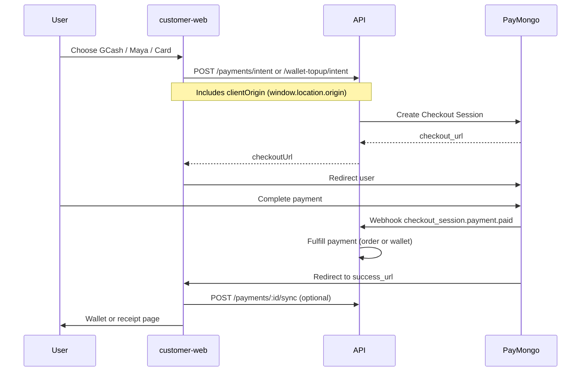

# PayMongo payments guide

Lunara uses [PayMongo](https://paymongo.com) Checkout Sessions for online payments in PHP: **GCash**, **Maya**, and **credit/debit card**. Wallet top-ups and order checkout share the same integration.

**Apps involved:** `apps/api`, `apps/customer-web`, `apps/customer-mobile`, `apps/rider-mobile` (cash), `apps/admin-web` (ops)

---

## Payment methods at a glance

| Method | Provider | Redirect? | Notes |
|--------|----------|-----------|-------|
| `gcash` | PayMongo | Yes | GCash checkout session |
| `maya` | PayMongo | Yes | Maya (`paymaya`) checkout session |
| `stripe` | PayMongo | Yes | Card (enum name is legacy — not Stripe) |
| `wallet` | Internal | No | Instant wallet debit; no external redirect |
| `cash` | Internal | No | Collected by rider at pickup or delivery |

---

## Cash on pickup / delivery

| Step | Behavior |
|------|----------|
| Customer checkout | `POST /payments/intent` with `method: cash`, `cashTiming: pickup \| delivery` |
| Order confirmed | Order moves to `pending_dispatch` immediately (no payment needed upfront) |
| Rider pickup | `POST /riders/pickup-tasks/:orderId/collect-cash` — API blocks pickup until cash collected if `cashTiming: pickup` |
| Rider delivery | `POST /riders/delivery-tasks/:orderId/collect-cash` — API blocks delivery completion if `cashTiming: delivery` and cash not yet collected |
| Customer track | Orders include `paymentMethod`, `paymentStatus`, `cashTiming`, receipt ref |
| Realtime | `paymentReceived` event emitted when rider records cash |

Cash is not refundable via the app. Rider mobile supports offline `collect-cash` queue.

Stage enforcement: `assertCashCollectedForStage` throws if the rider tries to advance the order (pickup or delivery) without first calling `collect-cash` for that stage.

---

## What PayMongo handles

| Flow | API route | After payment |
|------|-----------|---------------|
| **Order checkout** | `POST /payments/intent` | Order → `pending_dispatch`, receipt shown |
| **Wallet top-up** | `POST /payments/wallet-topup/intent` | Wallet credited, user returns to `/wallet` |

Other methods:

- **Lunara Wallet** — instant wallet debit, order confirmed synchronously, no redirect
- **Cash** — booking confirmed immediately, payment stays `pending` until rider calls `collect-cash`

---

## Environment variables

Set these on the **API** (root `.env` or hosting provider):

| Variable | Required | Description |
|----------|----------|-------------|
| `PAYMONGO_SECRET_KEY` | Yes (production) | Secret key from PayMongo dashboard (`sk_test_…` or `sk_live_…`) |
| `PAYMONGO_WEBHOOK_SECRET` | Yes (production) | Signing secret for your webhook endpoint (`whsk_…` or hook secret from dashboard) |
| `CUSTOMER_WEB_URL` | Yes | Public customer web URL, e.g. `https://lunara.app` or `http://localhost:3000` |
| `API_URL` | Yes | Public API base used for dev mock redirects, e.g. `https://api.lunara.app` or `http://localhost:3001` |
| `PAYMENT_WEBHOOK_SECRET` | Optional | Legacy guard for `POST /payments/:id/confirm` (not used by PayMongo webhooks) |

Example (`.env`):

```env
PAYMONGO_SECRET_KEY=sk_test_xxxxxxxx
PAYMONGO_WEBHOOK_SECRET=whsk_xxxxxxxx
CUSTOMER_WEB_URL=http://localhost:3000
API_URL=http://localhost:3001
```

When `PAYMONGO_SECRET_KEY` is **empty**, order checkout falls back to **dev mock** pages at `/api/v1/payments/mock/paymongo/*` (disabled when `NODE_ENV=production`). Wallet top-up still uses mock checkout in that mode. Production must set real keys.

---

## PayMongo dashboard setup

### 1. Create / open your PayMongo account

- [PayMongo Dashboard](https://dashboard.paymongo.com)
- Use **Test mode** for development (`sk_test_…` keys)

### 2. Enable payment methods

In the dashboard, enable the methods you need:

- GCash
- Maya (PayMongo API type: `paymaya`)
- Cards

### 3. Create a webhook endpoint

1. Go to **Developers → Webhooks** (or **Webhooks** in settings).
2. Add endpoint URL:

   ```
   https://<your-api-host>/api/v1/payments/webhooks/paymongo
   ```

   Local dev: use [ngrok](https://ngrok.com) or similar to expose port `3001`, e.g.

   ```
   https://abc123.ngrok-free.app/api/v1/payments/webhooks/paymongo
   ```

3. Subscribe to events (at minimum):

   - `checkout_session.payment.paid`
   - `payment.paid` (backup)

4. Copy the **webhook signing secret** → `PAYMONGO_WEBHOOK_SECRET`.

### 4. API keys

Copy **Secret key** → `PAYMONGO_SECRET_KEY` on the API server. Never expose this in customer-web or mobile env vars.

---

## How checkout works



### Success URLs

| Purpose | Redirect after PayMongo |
|---------|-------------------------|
| Order | `{origin}/checkout/{orderId}/success?paymentId={id}` |
| Wallet top-up | `{origin}/wallet?topupPaymentId={id}` |

`origin` comes from `clientOrigin` sent by the browser (`window.location.origin`), so the user returns to the **same host** they signed in on (important when using LAN IP vs `localhost`).

In production, `clientOrigin` must match `CUSTOMER_WEB_URL` host or it falls back to `CUSTOMER_WEB_URL`.

### Fulfillment

Payments are marked **paid** when:

1. **Webhook** — `POST /payments/webhooks/paymongo` (primary), or
2. **Sync** — `POST /payments/:id/sync` when the user lands on success/wallet return (polls PayMongo session status)

Wallet credits are **idempotent** (duplicate webhooks do not double-credit).

### Pending payment cleanup

Before creating a new payment intent, any previous `pending` payments for the same order (or wallet top-up) are **deleted** automatically. This prevents stale sessions from blocking a retry.

### Session expiry

If `syncPaymongoPayment` finds that a PayMongo session status is `expired` and the local payment is still `pending`, the payment is marked `failed`. The customer can start a new checkout.

### Realtime events on fulfillment

When an order payment is confirmed (webhook or sync), the API emits three Socket.IO events via `TrackingGateway`:

| Event | Audience | Payload |
|-------|----------|---------|
| `awaitingDispatch` | Customer (order room) | Message that pickup starts after dispatch |
| `adminDispatcherAlert` | Admin web | `{ type: 'awaiting_shop', orderId, status }` — prompts assigning a laundry shop |
| `dispatchQueueUpdated` | Admin web | `{ reason: 'payment_confirmed', orderId }` — refreshes dispatch board |

For cash payments, a `paymentReceived` event is emitted when the rider records cash collection.

---

## API reference

| Method | Path | Auth | Description |
|--------|------|------|-------------|
| `POST` | `/payments/intent` | JWT | Start order payment. Body: `orderId`, `method`, optional `cashTiming`, `clientOrigin` |
| `POST` | `/payments/wallet-topup/intent` | JWT | Start wallet top-up. Body: `amount` (min ₱100), `method`, `clientOrigin` |
| `GET` | `/payments/orders/:orderId` | JWT | Checkout summary; auto-syncs pending PayMongo session |
| `GET` | `/payments/:id` | JWT | Payment + order; auto-syncs pending PayMongo session |
| `POST` | `/payments/:id/sync` | JWT | Poll PayMongo and fulfill if paid |
| `POST` | `/payments/webhooks/paymongo` | PayMongo signature | Webhook handler |
| `POST` | `/payments/:id/confirm` | `x-payment-webhook-secret` header | Legacy confirm (deprecated; use webhook or sync instead) |

**`POST /payments/intent` response variants:**

| method | `paid` | Additional fields | What happens |
|--------|--------|-------------------|--------------|
| `wallet` | `true` | `receiptCode` | Wallet debited synchronously, order confirmed |
| `cash` | `false` | `cash: true`, `cashTiming`, `receiptCode`, `message` | Order confirmed, rider collects later |
| `gcash` / `maya` / `stripe` | `false` | `checkoutUrl`, `provider: 'paymongo'` | Redirect user to `checkoutUrl` |

### Payment methods (`method` field)

| Lunara enum | PayMongo checkout type | UI label | Notes |
|-------------|------------------------|----------|-------|
| `gcash` | `gcash` | GCash | PayMongo method |
| `maya` | `paymaya` | Maya | PayMongo method |
| `stripe` | `card` | Card | PayMongo method; enum name is legacy, not Stripe |
| `wallet` | — | Lunara Wallet | Internal; instant debit |
| `cash` | — | Cash | Collected by rider |

### Metadata on PayMongo sessions

Stored on each session for webhook matching:

- `lunara_payment_id` — MongoDB payment `_id`
- `lunara_purpose` — `order` or `wallet_topup`
- `lunara_user_id` — customer user id

---

## Customer apps

### customer-web

| Page | Behavior |
|------|----------|
| `/checkout/[orderId]` | Payment method picker → redirect to PayMongo |
| `/checkout/[orderId]/success` | Syncs payment, shows receipt |
| `/wallet` | Top-up form → PayMongo → return with `?topupPaymentId=` |

### customer-mobile

- Checkout and wallet open PayMongo in the **device browser** (`Linking.openURL`).
- Sends `clientOrigin` from `EXPO_PUBLIC_WEBSITE_URL` (defaults to production site) so PayMongo success/cancel URLs match customer-web.
- After payment in browser, user lands on customer-web success/wallet URL — pull to refresh in the app or reopen checkout to sync (`POST /payments/:id/sync`).
- Set `EXPO_PUBLIC_WEBSITE_URL=http://localhost:3000` in dev so returns match your local customer-web session.

---

## Local development

### With PayMongo test keys (recommended)

1. Set `PAYMONGO_SECRET_KEY` and `PAYMONGO_WEBHOOK_SECRET` in root `.env`.
2. Run API and customer-web:

   ```bash
   npm run dev --workspace=@lunara/api
   npm run dev --workspace=@lunara/customer-web
   ```

3. Expose API for webhooks (ngrok):

   ```bash
   ngrok http 3001
   ```

4. Register webhook URL in PayMongo pointing to `https://<ngrok>/api/v1/payments/webhooks/paymongo`.

5. Use PayMongo **test cards** and test GCash/Maya flows per [PayMongo docs](https://developers.paymongo.com).

### Without PayMongo keys (mock only)

- Leave `PAYMONGO_SECRET_KEY` empty.
- Order checkout uses mock HTML at `/api/v1/payments/mock/paymongo/checkout` → **Pay now** → redirects back to customer-web.
- Wallet top-up uses the same mock flow.
- No real money moves.

### Auth after redirect

- Always open customer-web on one origin (e.g. only `http://localhost:3000`, not mixing with `127.0.0.1` or LAN IP).
- The app sends `clientOrigin` so PayMongo returns you to the correct host.
- If the access token expired during checkout, the API client retries refresh once before signing you out.

---

## Production checklist

- [ ] `PAYMONGO_SECRET_KEY` = **live** secret key (`sk_live_…`)
- [ ] `PAYMONGO_WEBHOOK_SECRET` set from live webhook endpoint
- [ ] Webhook URL registered and reachable (HTTPS)
- [ ] `CUSTOMER_WEB_URL` = production customer site
- [ ] `API_URL` = production API (for any mock-disabled paths)
- [ ] PayMongo account verified, GCash/Maya/card enabled for live
- [ ] Test order checkout end-to-end
- [ ] Test wallet top-up end-to-end
- [ ] Confirm webhook deliveries in PayMongo dashboard (no repeated failures)
- [ ] Refunds: Lunara credits **Lunara Wallet** for online payments; PayMongo refunds to original instrument are not automated yet

---

## Troubleshooting

| Symptom | Likely cause | Fix |
|---------|--------------|-----|
| Redirect to **login** after PayMongo | Wrong return host (lost `localStorage` session) | Use same URL to browse and pay; ensure `clientOrigin` is sent (customer-web does this automatically) |
| Payment stays **pending** after PayMongo | Sync checked session `status === 'paid'` (wrong — sessions are `active`/`expired`) | Fixed: sync reads `payments[].status === 'paid'`. Checkout page auto-syncs on load. |
| Webhook not received | No ngrok / wrong URL | Register webhook; use sync on return URL as backup |
| `PayMongo is not configured` | Missing secret key | Set `PAYMONGO_SECRET_KEY` on API |
| `Use POST /payments/wallet-topup/intent` | Calling old `POST /wallets/topup` with keys set | Use PayMongo top-up flow only |
| Webhook **401/400** | Bad signature | Match `PAYMONGO_WEBHOOK_SECRET`; signature is `HMAC-SHA256(t + "." + body)` compared to `te`/`li` in `Paymongo-Signature` header |
| Expired PayMongo session | User abandoned checkout | Sync marks payment `failed`; customer can start checkout again |
| Amount mismatch | PayMongo uses **centavos** | API converts `amount * 100` automatically |

---

## Security notes

### `clientOrigin` validation

`resolveWebOrigin` validates the `clientOrigin` sent by the browser:
- In **production**: origin host must match `CUSTOMER_WEB_URL` host exactly; any mismatch falls back to `CUSTOMER_WEB_URL`.
- In **development**: any valid `http://` or `https://` origin is accepted.
- Invalid URLs, empty strings, or non-http protocols always fall back to `CUSTOMER_WEB_URL`.

This prevents an attacker from crafting a payment intent that redirects to an arbitrary host after PayMongo.

### Webhook signature

`verifyWebhookSignature` uses `timingSafeEqual` for constant-time comparison to prevent timing attacks. The `Paymongo-Signature` header format:

```
t=<timestamp>,te=<hmac-hex>       # test mode
t=<timestamp>,li=<hmac-hex>       # live mode
```

HMAC input: `${timestamp}.${rawBody}` with `PAYMONGO_WEBHOOK_SECRET` as the key.

---

## Related code

| Area | Path |
|------|------|
| PayMongo client | `apps/api/src/modules/payments/paymongo.service.ts` |
| Payment logic | `apps/api/src/modules/payments/payments.service.ts` |
| Routes | `apps/api/src/modules/payments/payments.controller.ts` |
| Payment schema | `apps/api/src/modules/payments/schemas/payment.schema.ts` |
| Shared helpers | `packages/utils/src/payment.ts` |
| Web checkout UI | `apps/customer-web/src/components/payment/` |
| Cash collection | `apps/api/src/modules/riders/pickup.service.ts`, `delivery.service.ts` |

---

## Further reading

- [PayMongo API — Checkout Sessions](https://developers.paymongo.com/reference/create-a-checkout)
- [PayMongo Webhooks](https://developers.paymongo.com/docs/webhooks)
- Lunara API index: [API_ENDPOINTS.md](./API_ENDPOINTS.md)
