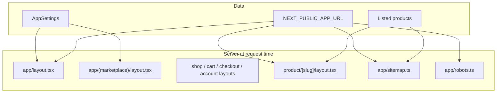

# Marketplace SEO

Documentation for the storefront SEO foundation: metadata, structured data, crawl files, and admin settings.

## Status

| Area | Status | Notes |
|------|--------|-------|
| Shared SEO helpers (`lib/seo/site.ts`) | Done | URLs, root/page metadata, site JSON-LD, `noindex` constant |
| Product metadata + JSON-LD | Done | Per-product fields; stock-based `availability` |
| Site-wide admin SEO settings | Done | Default meta description + OG image in Application settings |
| Root + marketplace metadata | Done | Dynamic `appName` / description from DB |
| Route layouts (shop, cart, checkout, account) | Done | Public titles; private routes `noindex` |
| Static pages (about, contact, categories, reviews) | Done | `generateMetadata` per page |
| Staff dashboard + auth + help `noindex` | Done | Dashboard, `/login`, `/help` (metadata + robots disallow) |
| `sitemap.xml` | Done | [`app/sitemap.ts`](../app/sitemap.ts) |
| `robots.txt` | Done | [`app/robots.ts`](../app/robots.ts) |
| Unit tests | Done | [`lib/seo/site.test.ts`](../lib/seo/site.test.ts), [`lib/products/seo.test.ts`](../lib/products/seo.test.ts) |
| `NEXT_PUBLIC_APP_URL` in `.env.example` | Done | Required for production canonicals |

---

## Configuration

### Environment

Set the public storefront origin (no trailing slash) before production go-live:

```bash
NEXT_PUBLIC_APP_URL=https://your-store.example.com
```

Used for:

- `metadataBase` and canonical URLs
- Open Graph `url` / image absolutization
- `sitemap.xml` and `robots.txt` sitemap reference

If unset, development falls back to `http://localhost:3000`. Production logs a warning when the variable is missing.

### Admin (Settings → Application)

| Field | DB / API key | Purpose |
|-------|----------------|---------|
| Application name | `appName` | Default `<title>`, `og:site_name`, JSON-LD brand |
| Tagline | `appTagline` | Fallback meta description when SEO description is empty |
| Default meta description | `seoDefaultDescription` | Max 160 chars; preferred site-wide description |
| Default social image | `seoOgImageUrl` | Open Graph / Twitter image; empty → app logo → `/logo.png` |

**Description fallback chain:** `seoDefaultDescription` → `appTagline` → generic line (`Shop online for quality products.`).

### Per-product SEO (Products → edit)

| Field | Limits | Fallback |
|-------|--------|----------|
| SEO title | 70 chars | `{product name} \| {appName}` |
| SEO meta description | 160 chars (Markdown stored; plain text in meta) | Short description → description excerpt |

---

## Architecture



### Key files

| File | Role |
|------|------|
| [`lib/seo/site.ts`](../lib/seo/site.ts) | `getSiteUrl`, `absoluteUrl`, `buildRootMetadata`, `buildPageMetadata`, `buildStorefrontMetadata`, `buildSiteJsonLd`, `ROBOTS_NOINDEX` |
| [`lib/products/seo.ts`](../lib/products/seo.ts) | Product title/description, page metadata, Product JSON-LD |
| [`app/layout.tsx`](../app/layout.tsx) | Root `generateMetadata` + favicon |
| [`app/(marketplace)/layout.tsx`](../app/(marketplace)/layout.tsx) | Storefront defaults + WebSite/Organization JSON-LD |
| [`app/(marketplace)/product/[slug]/layout.tsx`](../app/(marketplace)/product/[slug]/layout.tsx) | Product metadata + Product JSON-LD (stock-aware) |
| [`app/(marketplace)/shop/layout.tsx`](../app/(marketplace)/shop/layout.tsx) | Shop page title/canonical |
| [`app/(marketplace)/cart/layout.tsx`](../app/(marketplace)/cart/layout.tsx) | `noindex` |
| [`app/(marketplace)/checkout/layout.tsx`](../app/(marketplace)/checkout/layout.tsx) | `noindex` |
| [`app/(marketplace)/account/layout.tsx`](../app/(marketplace)/account/layout.tsx) | `noindex`; shell in [`AccountLayoutClient.tsx`](../components/marketplace/account/AccountLayoutClient.tsx) |
| [`app/(dashboard)/layout.tsx`](../app/(dashboard)/layout.tsx) | `noindex` |
| [`app/(auth)/layout.tsx`](../app/(auth)/layout.tsx) | `noindex`; staff sign-in title |
| [`app/sitemap.ts`](../app/sitemap.ts) | Static routes + product URLs |
| [`app/robots.ts`](../app/robots.ts) | Allow `/`; disallow private/staff paths |
| [`lib/services/marketplace.service.ts`](../lib/services/marketplace.service.ts) | `listMarketplaceProductSlugs()` for sitemap |

### Indexed public routes

- `/` (home)
- `/shop`
- `/about-us`, `/contact`, `/categories`, `/reviews`
- `/faqs`, `/shipping-delivery`, `/returns-refunds`, `/privacy-policy`
- `/product/{slug}` (marketplace-listed, active products only)

### Not indexed (`robots: noindex`)

- `/cart`, `/checkout` (and checkout success/return)
- `/account` (all account sub-routes)
- Staff app: `/pos`, `/products`, `/inventory`, `/dashboard`, `/settings`, `/purchase-orders`, `/admin`, `/help`, etc. (see [`app/robots.ts`](../app/robots.ts) `disallow` list)
- `/login`, `/setup`, `/maintenance`
- `/api/*` (disallow in robots; not HTML anyway)

Client-rendered catalog pages (`/`, `/shop`) still receive correct `<head>` tags from parent **server** layouts; crawlers do not require a full SSR refactor for basic SEO.

---

## Sitemap

**URL:** `{NEXT_PUBLIC_APP_URL}/sitemap.xml`

**Static entries:** `/`, `/shop`, `/about-us`, `/contact`, `/categories`, `/reviews`, `/faqs`, `/shipping-delivery`, `/returns-refunds`, `/privacy-policy`

**Dynamic entries:** one URL per listed product (`listedFilter` in marketplace service — active, not deleted, `marketplaceListed` true or unset).

**Product query:** `listMarketplaceProductSlugs()` — `slug`, `updatedAt` for `lastModified`.

---

## Robots

**URL:** `{NEXT_PUBLIC_APP_URL}/robots.txt`

- `Allow: /`
- `Disallow:` private and staff paths (see source in [`app/robots.ts`](../app/robots.ts))
- `Sitemap:` full URL to `sitemap.xml`

---

## Manual verification checklist

After deploy, with `NEXT_PUBLIC_APP_URL` set:

- [ ] **Home** — View source on `/`: `<title>`, `meta name="description"`, `og:*`, `link rel="canonical"` (if page-specific)
- [ ] **Product** — View source on `/product/{slug}`: unique title, description, canonical, Product JSON-LD script
- [ ] **Shop** — Title includes “Shop” (template: `Shop | {appName}`)
- [ ] **Sitemap** — Open `/sitemap.xml`; static URLs + product URLs present
- [ ] **Robots** — Open `/robots.txt`; disallows `/account`, `/cart`, `/checkout`, staff paths; sitemap URL correct
- [ ] **Rich Results** — [Google Rich Results Test](https://search.google.com/test/rich-results) on a product URL; `Product` with `InStock` / `OutOfStock` matching inventory
- [ ] **Admin** — Change Settings → Storefront SEO and a product’s SEO fields; confirm head tags update after refresh
- [ ] **Private routes** — View source on `/cart` or `/account`: `noindex` in robots meta

---

## Tests

```bash
npm test -- lib/seo/site.test.ts lib/products/seo.test.ts
```

Covers URL helpers, description fallback, and product JSON-LD availability from stock.

---

## Follow-up todos (not implemented)

Use this list for the next SEO iteration:

| Todo | Priority | Description |
|------|----------|-------------|
| Google Search Console verification | Medium | Env-driven `<meta name="google-site-verification" content="…" />` when token is available |
| Submit sitemap in GSC | Medium | After production URL is live, add property and submit `/sitemap.xml` |
| `hreflang` / locales | Low | Only if multi-language storefront is planned |
| Help / KB article SEO | Low | Dashboard help at `/help/*` remains `noindex`; optional public docs strategy |
| SSR catalog HTML | Low | Optional richer crawler content for `/` and `/shop` (metadata-only is sufficient for many cases) |
| Category landing metadata | Low | `/categories` is static marketing; `/shop?category=` could get dynamic titles later |
| Breadcrumb JSON-LD | Low | Product + category trail for richer snippets |
| `og:type` product pages | Low | Consider `product` OG type where supported |
| Audit disallow list | Low | When new staff routes ship, update [`app/robots.ts`](../app/robots.ts) |
| Production env checklist | High | Confirm `NEXT_PUBLIC_APP_URL` on Vercel/host; smoke-test sitemap in staging |

---

## Related docs

- **In-app help (staff):** [/help/storefront-seo](/help/storefront-seo), [/help/settings](/help/settings), [/help/products](/help/products)
- Full audit (Help + SEO): [`full-audit-help-seo.md`](./full-audit-help-seo.md)
- Help KB maintenance: [`help-knowledgebase-sync.md`](./help-knowledgebase-sync.md)
- In-app product form: SEO section in [`components/products/ProductForm.tsx`](../components/products/ProductForm.tsx)
- Environment template: [`.env.example`](../.env.example)
