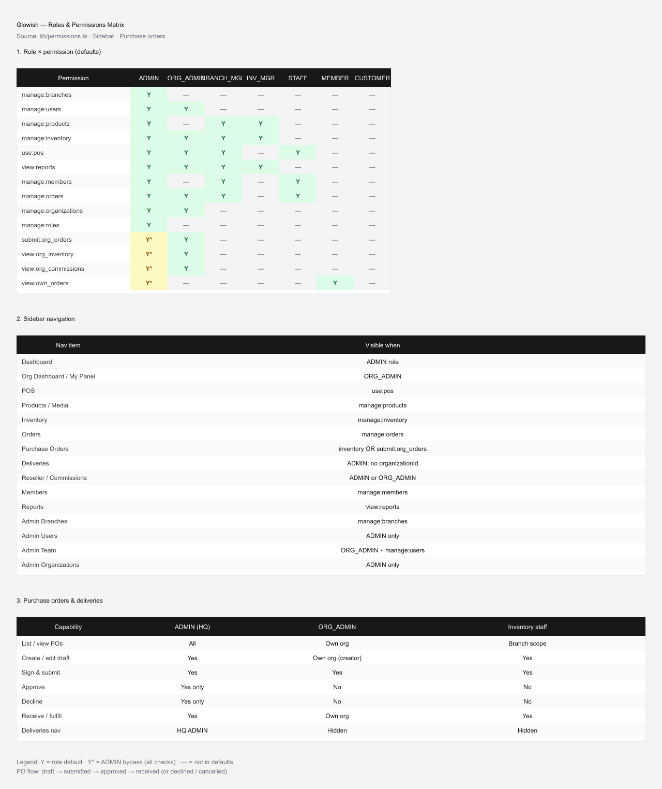

# Roles & permissions matrix



> Regenerate: `node scripts/generate-permissions-matrix-image.mjs` (writes `.svg` and `.png`).

Authoritative runtime defaults live in [`lib/permissions.ts`](../lib/permissions.ts). Purchase-order rules also use [`lib/permissions/purchaseOrders.ts`](../lib/permissions/purchaseOrders.ts). The sidebar mirrors most access rules in [`components/layout/Sidebar.tsx`](../components/layout/Sidebar.tsx).

## How access is evaluated

1. **Staff login** — JWT session includes `role`, `permissions` (extra grants on the user record), `branchIds`, and optional `organizationId`.
2. **Effective permissions** — `effectivePermissions()` merges **role defaults** with **per-user** `permissions[]` (deduplicated).
3. **Platform admin** — `ADMIN` bypasses every `hasPermission` / `hasAnyPermission` check in middleware and UI guards that use those helpers.
4. **API routes** — `withStaffAuth` + `withPermission` / `withAnyPermission` (see [`lib/middleware/withPermission.ts`](../lib/middleware/withPermission.ts)).
5. **Data scope** — Even with permission, services often filter by `branchIds` or `organizationId` (e.g. org admins only see their org’s purchase orders).

`MEMBER` and `CUSTOMER` are blocked from the dashboard layout (`app/(dashboard)/layout.tsx`). `CUSTOMER` uses the marketplace account area.

---

## User roles

| Role | Scope | Typical persona |
|------|--------|-----------------|
| **ADMIN** | Whole tenant (HQ platform) | Platform operator |
| **ORG_ADMIN** | Single `organizationId` | Distributor / franchise / partner admin |
| **BRANCH_MANAGER** | Assigned `branchIds` | Branch lead |
| **INVENTORY_MANAGER** | Assigned branches (inventory APIs) | Stock / procurement staff |
| **STAFF** | Assigned branches | Cashier |
| **MEMBER** | Member portal (limited) | Loyalty member |
| **CUSTOMER** | Storefront account | Online shopper |

---

## Role × permission matrix (defaults)

Legend: **Y** = included in role defaults · **—** = not included (may still be granted per-user on the user record)

| Permission | ADMIN | ORG_ADMIN | BRANCH_MANAGER | INVENTORY_MANAGER | STAFF | MEMBER | CUSTOMER |
|------------|:-----:|:---------:|:--------------:|:-----------------:|:-----:|:------:|:--------:|
| `manage:branches` | Y | — | — | — | — | — | — |
| `manage:users` | Y | Y | — | — | — | — | — |
| `manage:products` | Y | — | Y | Y | — | — | — |
| `manage:inventory` | Y | Y | Y | Y | — | — | — |
| `use:pos` | Y | Y | Y | — | Y | — | — |
| `view:reports` | Y | Y | Y | Y | — | — | — |
| `manage:members` | Y | — | Y | — | Y | — | — |
| `manage:orders` | Y | Y | Y | — | Y | — | — |
| `manage:organizations` | Y | Y | — | — | — | — | — |
| `manage:roles` | Y | — | — | — | — | — | — |
| `submit:org_orders` | Y* | Y | — | — | — | — | — |
| `view:org_inventory` | Y* | Y | — | — | — | — | — |
| `view:org_commissions` | Y* | Y | — | — | — | — | — |
| `view:own_orders` | Y* | — | — | — | — | Y | — |

\* **ADMIN** receives all permission checks via bypass; cells marked Y* are not in the ADMIN default list but are allowed in practice.

### Permission descriptions

| Key | Meaning |
|-----|---------|
| `manage:branches` | Branches CRUD, branch user assignments |
| `manage:users` | Staff user CRUD (platform or org team, depending on role) |
| `manage:products` | Product catalog, variants, media, import/export |
| `manage:inventory` | Branch inventory, movements, suppliers, PO receive/fulfill |
| `use:pos` | POS catalog + checkout |
| `view:reports` | Analytics / reports API |
| `manage:members` | Member CRUD |
| `manage:orders` | Order list/detail, B2B create |
| `manage:organizations` | Organization CRUD, org permissions, commissions (admin) |
| `manage:roles` | Role definitions (platform) |
| `submit:org_orders` | Create/submit purchase orders for own organization |
| `view:org_inventory` | Org-scoped inventory views |
| `view:org_commissions` | Org commission views |
| `view:own_orders` | Member’s own orders |

---

## Sidebar navigation matrix

Rules are evaluated in order: `excludeRoles` → `hideForOrgUsers` (user has `organizationId`) → `roles` / `anyPermission` / `permission` / `allAuthenticated`.

| Nav item | Visible when |
|----------|----------------|
| Dashboard | `role === ADMIN` |
| Org Dashboard | `role === ORG_ADMIN` |
| My Panel | `role === ORG_ADMIN` |
| Online store | Any authenticated dashboard user |
| POS | `use:pos` |
| Products, Media | `manage:products` |
| Inventory | `manage:inventory` |
| Orders | `manage:orders` |
| Purchase Orders | `manage:inventory` **or** `submit:org_orders` |
| **Deliveries** | `role === ADMIN` **and** not `ORG_ADMIN` **and** no `organizationId` |
| Reseller Sales, Commissions | `ADMIN` or `ORG_ADMIN` |
| Members | `manage:members` |
| Reports | `view:reports` |
| Help & guides | Any authenticated dashboard user |
| Settings | Any staff role except `MEMBER` |
| Admin → Branches | `manage:branches` |
| Admin → Users | `ADMIN` only |
| Admin → Team | `ORG_ADMIN` + `manage:users` |
| Admin → Organizations | `ADMIN` only |

---

## Purchase orders & deliveries

### Workflow

```text
draft → submitted → approved → received
              ↘ declined
              ↘ cancelled (from draft/submitted)
```

### Capability matrix (business rules)

| Capability | ADMIN (HQ) | ORG_ADMIN (distributor) | `manage:inventory` (branch/HQ staff) |
|------------|:----------:|:-----------------------:|:------------------------------------:|
| List / view POs (scoped) | All | Own org | HQ / branch scope |
| Create / edit draft | Yes | Own org; draft edits **creator only** | Yes |
| Sign & submit | Yes | Yes | Yes |
| Approve (signature) | **Yes only** | No | No |
| Decline | **Yes only** | No | No |
| Receive / fulfill (inventory) | Yes | Own org (if org has inventory) | Yes |
| Download PDF | Yes | Yes (if can view PO) | Yes |
| Catalog template API | Yes | Yes | Yes |
| **Deliveries** nav | Yes (no `organizationId`) | **Hidden** | Hidden (nav); API may still allow if permitted |

Helpers: `canApprovePurchaseOrders`, `canSubmitOrgPurchaseOrders`, `canManagePurchaseOrdersInventory` in [`lib/permissions/purchaseOrders.ts`](../lib/permissions/purchaseOrders.ts).

### PO-related API gates

| Route pattern | Middleware |
|---------------|------------|
| `/api/purchase-orders`, `/api/purchase-orders/[id]`, template, pdf, sign | `manage:inventory` **or** `submit:org_orders` |
| `/api/purchase-orders/[id]/receive` | `manage:inventory` |
| `/api/purchase-orders/[id]/decline` | `withStaffAuth` only → service enforces **ADMIN** |
| `/api/deliveries` | `manage:inventory` **or** `submit:org_orders` (nav is stricter) |

---

## Organization type — Inventory & POS isolation

Org-bound users (`ORG_ADMIN`) see **Inventory** and **POS** based on organization **type** and **settings** (see `lib/organization/capabilities.ts`). Session includes `organizationCapabilities`.

| Organization type | Inventory surface | POS |
|-------------------|-------------------|-----|
| **distributor** | Organization warehouse (`OrganizationInventory`) | Hidden |
| **headquarters** | Organization warehouse | Hidden |
| **franchise** | Branch stock (branches linked to org) | Branch POS |
| **partner** | Hidden (no warehouse) | Branch POS (if org has branches) |

Overrides: `settings.hasInventory` and `settings.canSellRetail` on the organization record can change the above.

---

## Organization-level permissions (B2B / org settings)

Separate from **user** permissions. Stored per organization in `OrgPermission` ([`lib/db/models/OrgPermission.ts`](../lib/db/models/OrgPermission.ts)).

| Key | Purpose |
|-----|---------|
| `sell:retail` | Organization may sell at retail |
| `distribute:stock` | May distribute stock downstream |
| `has:inventory` | Org inventory features enabled |
| `earn:commission` | Commission tracking enabled |
| `submit:orders` | May submit B2B / order flows |

Managed via `/api/organizations/[id]/permissions` (`manage:organizations`).

---

## API permission quick reference

| Area | Required permission(s) |
|------|-------------------------|
| Branches | `manage:branches` |
| Users | `manage:users` |
| Products (read for PO builders) | `manage:products` **or** `submit:org_orders` (GET list/variants) |
| Products (write) | `manage:products` |
| Media | `manage:products` |
| Inventory / movements / suppliers | `manage:inventory` |
| Org inventory (org admin) | `manage:organizations` + `allowRoles: ORG_ADMIN` |
| Orders / B2B | `manage:orders` |
| POS products | `use:pos` |
| POS checkout | `use:pos` |
| Members | `manage:members` |
| Reports | `view:reports` |
| Organizations | `manage:organizations` |
| Commissions (org view) | `manage:organizations` + `ORG_ADMIN` |
| Reseller orders | `manage:organizations` + `ORG_ADMIN` |
| Purchase orders | See PO table above |

---

## Syncing roles to the database

**Source of truth:** [`lib/permissions.ts`](../lib/permissions.ts) (`DEFAULT_ROLE_PERMISSIONS`).

After changing role defaults:

```bash
pnpm sync:roles
```

This upserts `Role` documents and sets each active user's `permissions` array to their role defaults (from [`lib/roles/systemRoles.ts`](../lib/roles/systemRoles.ts)).

| Option | CLI | API body |
|--------|-----|----------|
| Roles only | `--roles-only` | `{ "syncUsers": false }` |
| Users only | `--users-only` | `{ "syncRoles": false }` |
| Preview | `--dry-run` | — |

**Admin API:** `POST /api/admin/roles/sync` (`manage:roles`) · `GET /api/admin/roles` compares code vs database.

Runtime checks still merge **code** role defaults with stored user grants via `effectivePermissions()`. Keep code and DB aligned by running sync after permission changes.

## Maintaining this document

When you add a role default, permission key, sidebar item, or API guard:

1. Update [`lib/permissions.ts`](../lib/permissions.ts), then run `pnpm sync:roles`.
2. Update this file and [`content/knowledgebase/roles-permissions.md`](../content/knowledgebase/roles-permissions.md).
3. Add or adjust tests under `lib/permissions.test.ts`, `lib/services/role.service.test.ts`, or feature-specific permission tests.
